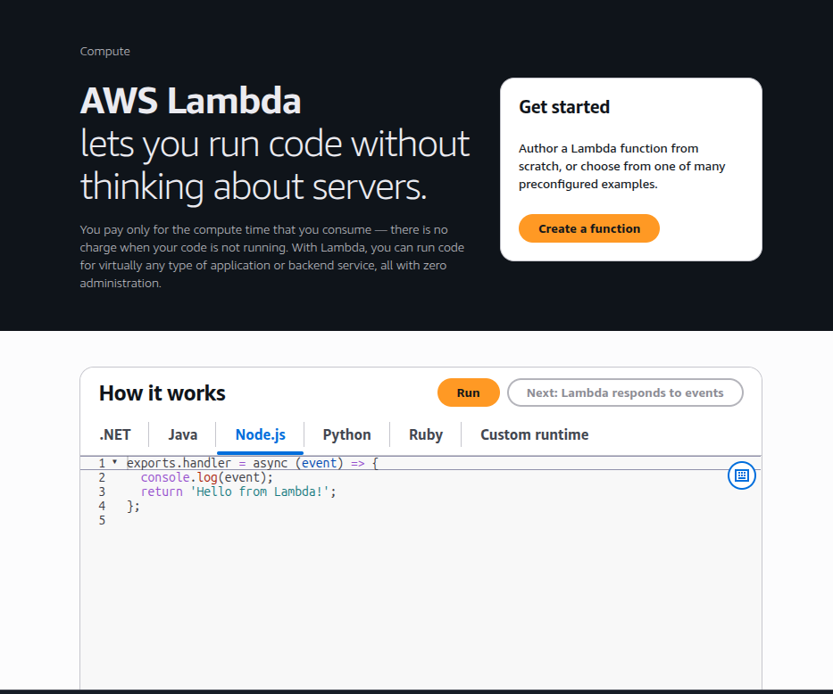
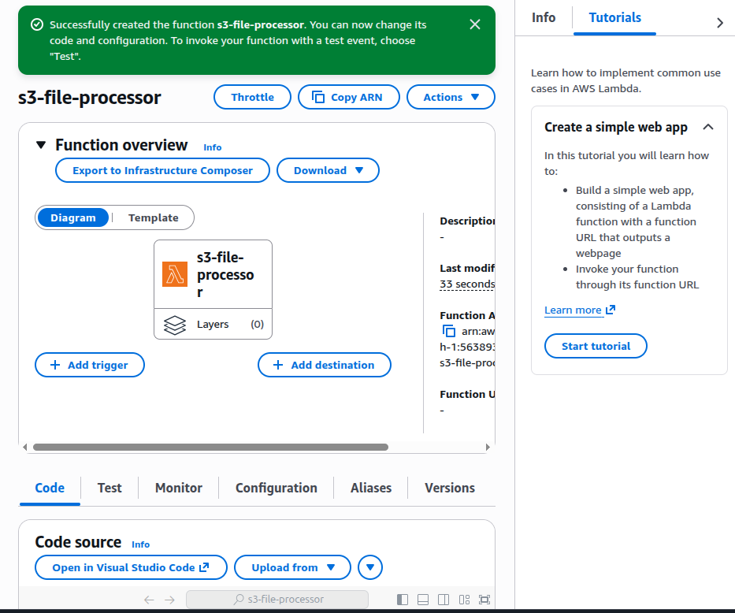
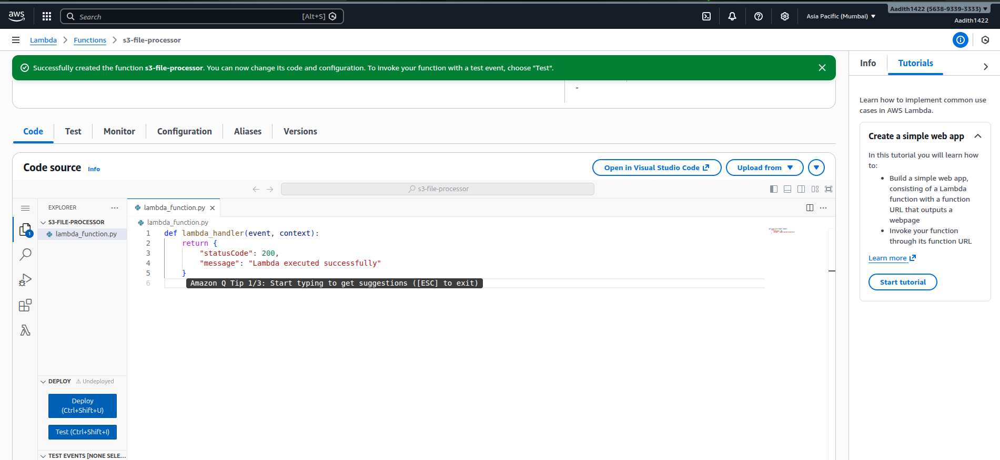
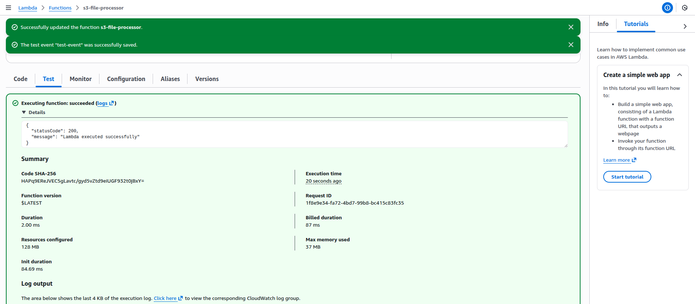

# Using AWS Lambda for Serverless Applications

## Aim
To explore AWS Lambda and create a serverless function that executes a simple task without provisioning or managing servers.

---

## Services Used
- AWS Lambda


---

## Theory

### AWS Lambda
AWS Lambda is a serverless compute service that allows developers to run code in response to events without managing servers. It automatically handles scaling, availability, and execution, and users are charged only for the compute time consumed.

---

## Procedure

### Step 1: Open AWS Lambda Console
The AWS Lambda service was opened from the AWS Management Console to begin creating a serverless function.



---

### Step 2: Create a Lambda Function
A new Lambda function named `s3-file-processor` was created using the **Author from scratch** option with Python as the runtime.



---

### Step 3: Write Lambda Function Code
The following Python code was added to the Lambda function to return a simple success message:

```python
def lambda_handler(event, context):
    return {
        "statusCode": 200,
        "message": "Lambda executed successfully"
    }
```

The code was deployed successfully.



---

### Step 4: Test the Lambda Function
A test event was created and the function was executed using the **Test** option. The execution completed successfully and returned the expected output.


---

### Step 5: View Lambda Function Overview
The Lambda function overview page was reviewed to confirm the function status, configuration, and deployment details.



---

## Result
The AWS Lambda function was created, deployed, and tested successfully. The function executed in a serverless environment and returned the expected response.

---

## Conclusion
This experiment demonstrated the use of AWS Lambda to run code without managing servers. Lambda simplifies application development by providing automatic scaling, high availability, and cost-efficient execution.

---
