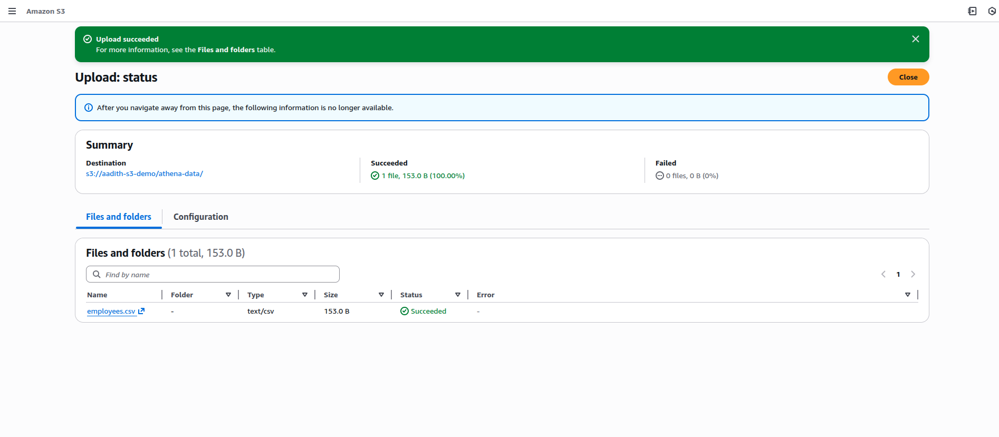
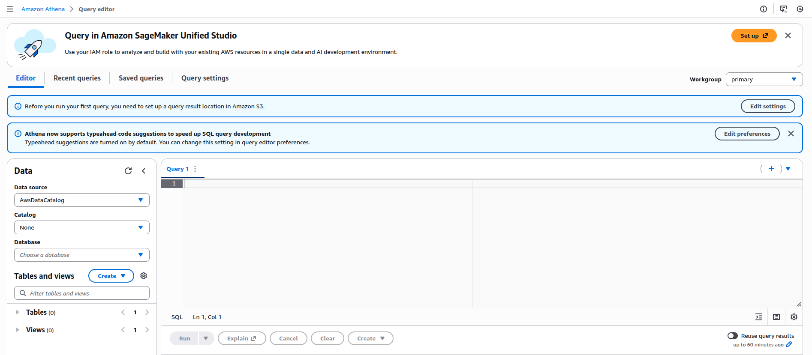
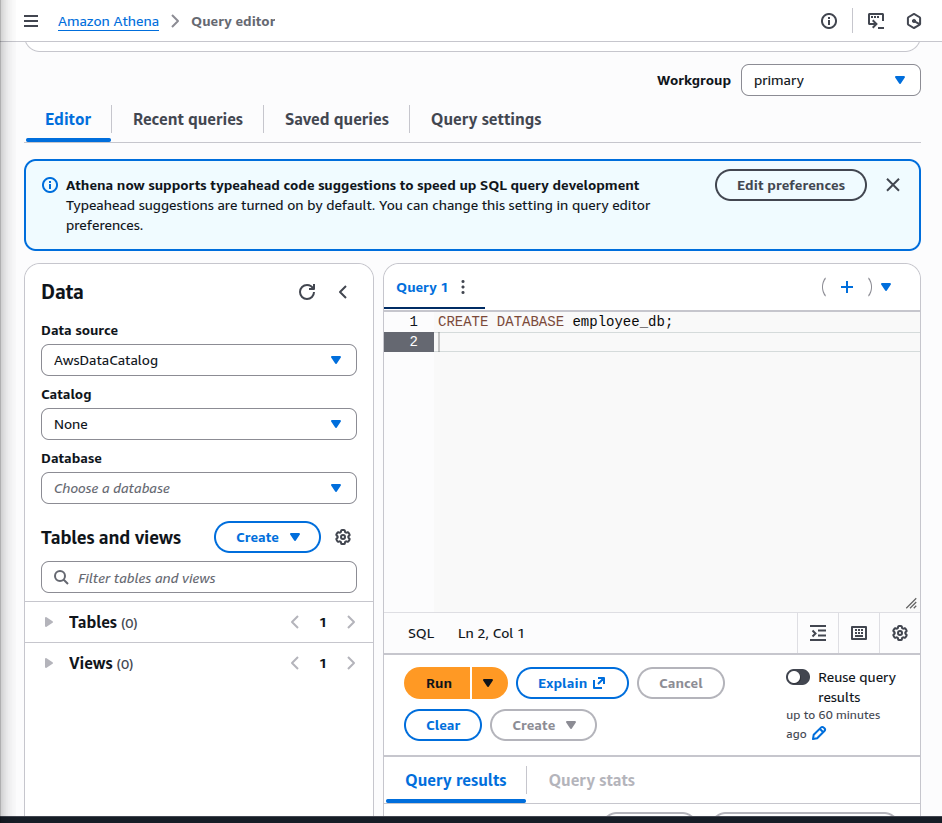
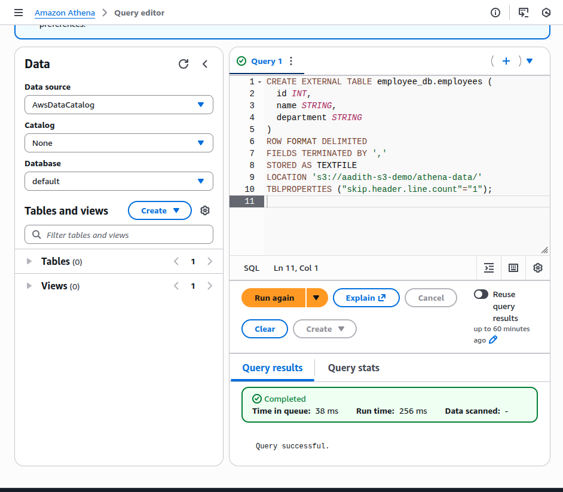

# Using Amazon Athena

## Aim
To query structured data stored in Amazon S3 using Amazon Athena without managing any servers.

---

## Services Used
- Amazon S3
- Amazon Athena

---

## Step 1: Upload Data to S3
A CSV file named `employees.csv` was uploaded to the following S3 location:

```
s3://aadith-s3-demo/athena-data/
```



---

## Step 2: Open Amazon Athena
Amazon Athena was opened from the AWS Management Console and the **Query your data in Athena console** option was selected.



---

## Step 3: Configure Query Result Location
The query result location was set to the following S3 path:

```
s3://aadith-s3-demo/athena-results/
```

This step is mandatory for running queries in Athena.

---

## Step 4: Create Database
The following SQL query was executed to create a database:

```sql
CREATE DATABASE employee_db;
```



---

## Step 5: Create External Table
An external table was created to map the CSV data stored in S3.

```sql
CREATE EXTERNAL TABLE employee_db.employees (
  id INT,
  name STRING,
  department STRING
)
ROW FORMAT DELIMITED
FIELDS TERMINATED BY ','
STORED AS TEXTFILE
LOCATION 's3://aadith-s3-demo/athena-data/'
TBLPROPERTIES ("skip.header.line.count"="1");
```



---

## Step 6: Query the Data
The following query was executed to fetch all records from the table:

```sql
SELECT * FROM employee_db.employees;
```

The query executed successfully and returned the employee records.


---

## Result
Amazon Athena successfully queried structured data stored in Amazon S3 using standard SQL without requiring any database servers.

---

## Conclusion
Amazon Athena is a serverless, cost-effective query service that allows users to analyze data stored in Amazon S3 using SQL. It eliminates the need for infrastructure management while providing fast query execution.

---

## Key Learning Outcomes
- Athena queries data directly from S3
- No server or database setup is required
- Costs are based only on data scanned
