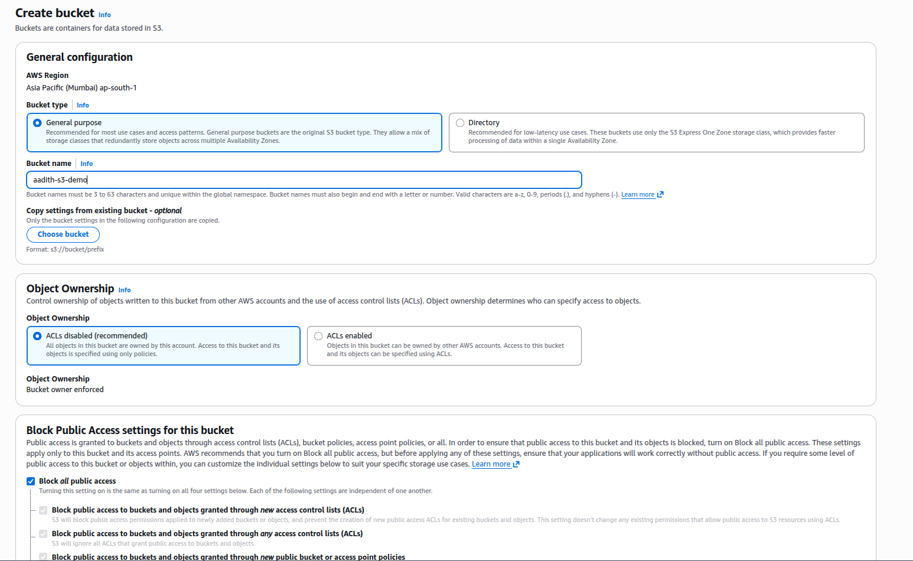
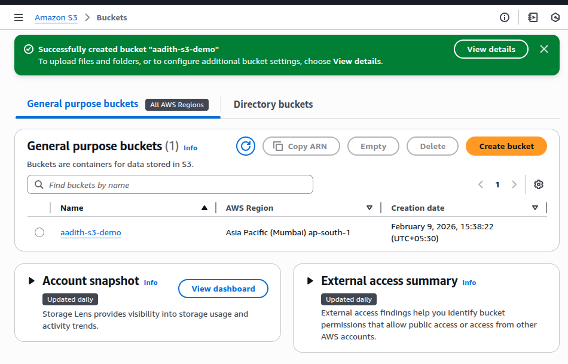
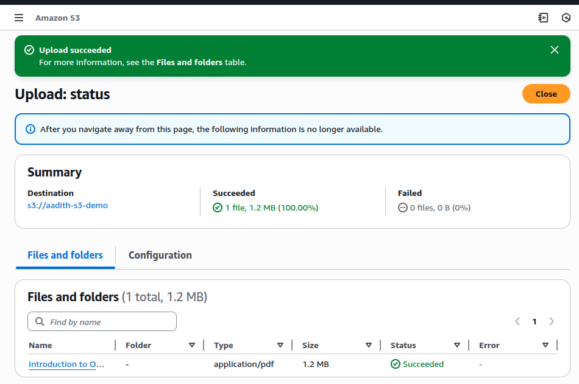
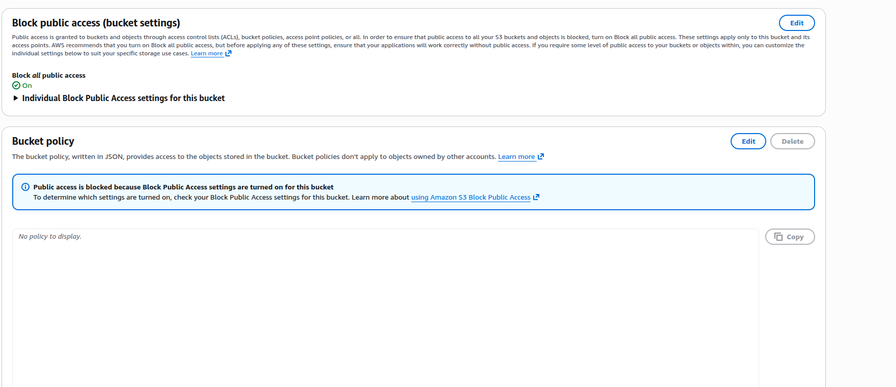
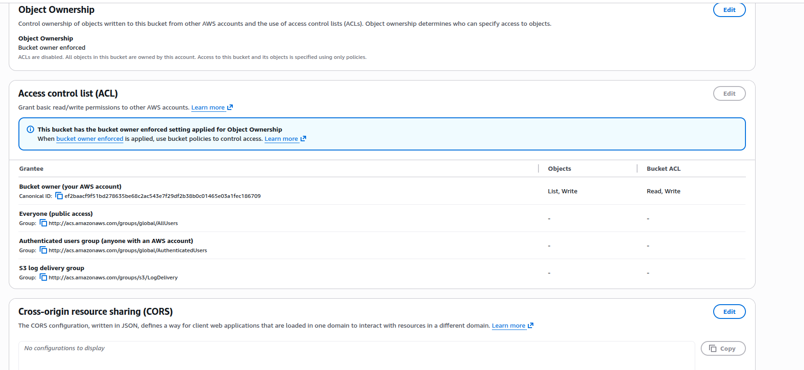
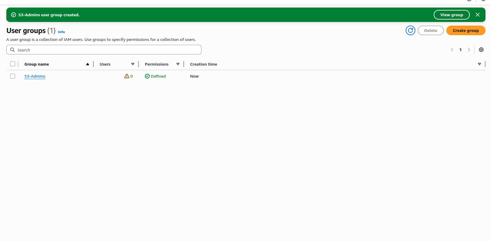
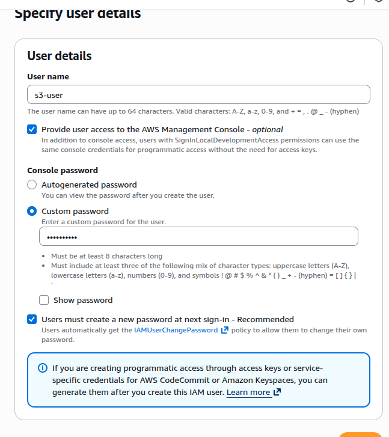
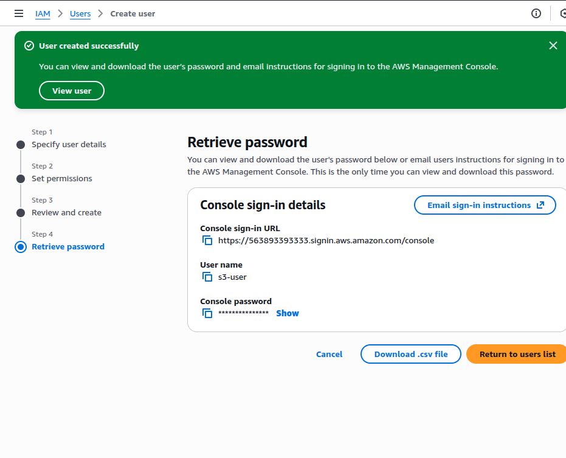
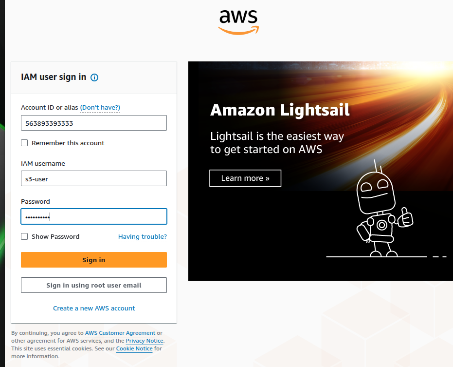
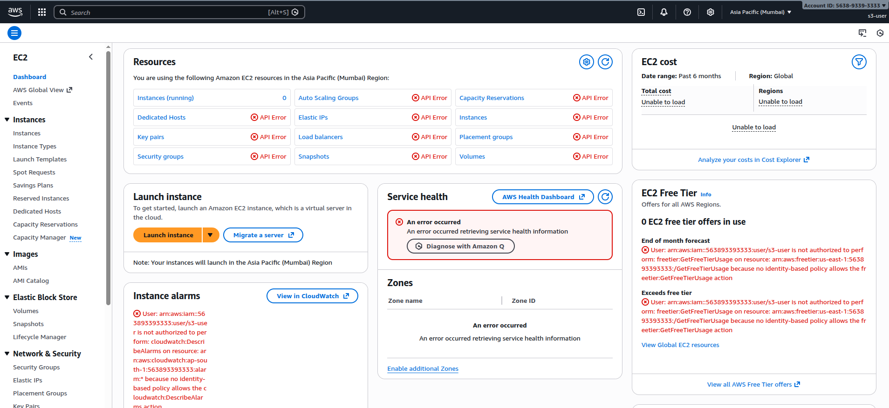

# Exploring Amazon S3 and IAM

## Aim
To explore Amazon S3 and IAM services by creating an S3 bucket, uploading objects, and managing secure access using IAM users, groups, and policies.

---

## Services Used
- Amazon S3
- AWS IAM

---

## Theory

### Amazon S3
Amazon Simple Storage Service (S3) is an object storage service that offers scalability, data availability, security, and performance.

### AWS IAM
Identity and Access Management (IAM) enables secure control of access to AWS services and resources.

---

## Procedure

### Step 1: Create an S3 Bucket
An S3 bucket named `aadith-s3-demo` was created in the Asia Pacific (Mumbai) region with public access blocked and ACLs disabled.

**Screenshot 1:**  

---

### Step 2: Verify Bucket Creation
The bucket was successfully created and listed in the S3 dashboard.

**Screenshot 2:**  

---

### Step 3: Upload Object to S3
A file was uploaded to the S3 bucket to verify object storage functionality.

**Screenshot 3:**  

---

### Step 4: Review Bucket Permissions
Bucket permissions were reviewed to confirm ACLs were disabled and public access was blocked.

**Screenshot 4:**  

---

### Step 5: Block Public Access & Bucket Policy
Public access settings were verified, and no bucket policy was applied.

**Screenshot 5:**  

---

### Step 6: Create IAM Group
An IAM group named `S3-Admins` was created with the AmazonS3FullAccess policy.

**Screenshot 6:**  

---

### Step 7: Create IAM User
An IAM user named `s3-user` was created with console access enabled.

**Screenshot 7:**  

---

### Step 8: Retrieve User Credentials
The IAM user’s login credentials were generated.

**Screenshot 8:**  

---

### Step 9: IAM User Login
The IAM user successfully logged in using the IAM sign-in URL.

**Screenshot 9:**  

---

### Step 10: IAM User Accessing S3
The IAM user accessed S3 and uploaded a file successfully.

**Screenshot 10:**  

---

### Step 11: Restricted Access to EC2
The IAM user attempted to access EC2 and was denied access.

**Screenshot 11:**  

---

## Result
The S3 bucket was successfully created and secured using IAM. The IAM user was able to access only authorized S3 resources.

---

## Conclusion
This experiment demonstrated secure object storage using Amazon S3 and access control using IAM, following AWS best practices.
