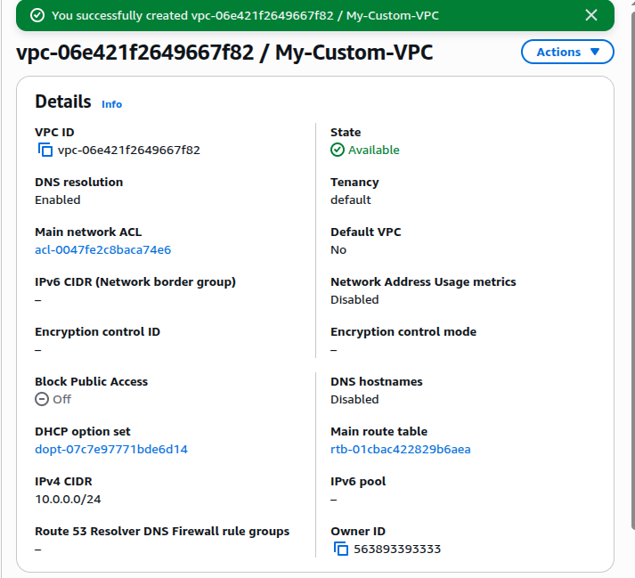
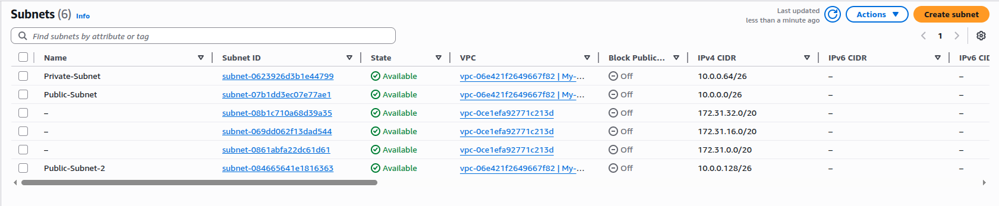
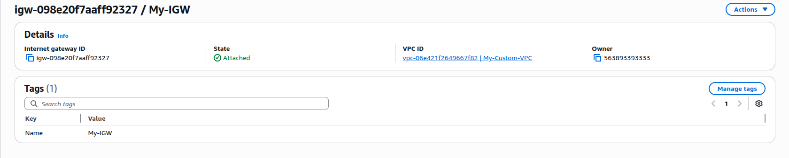
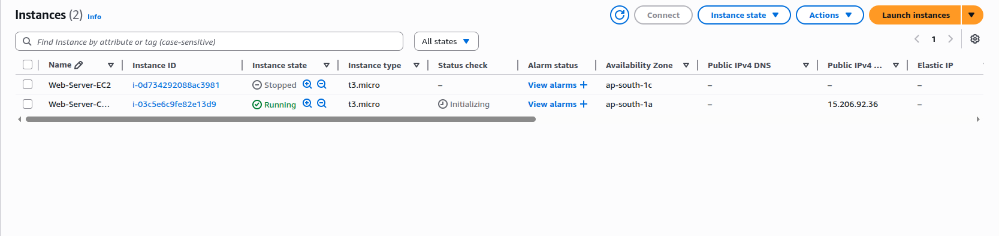
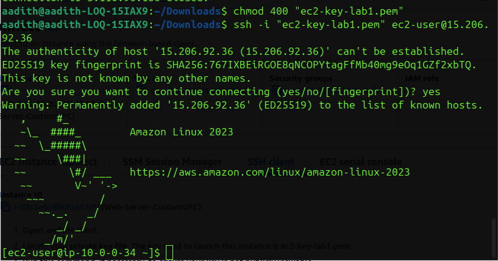
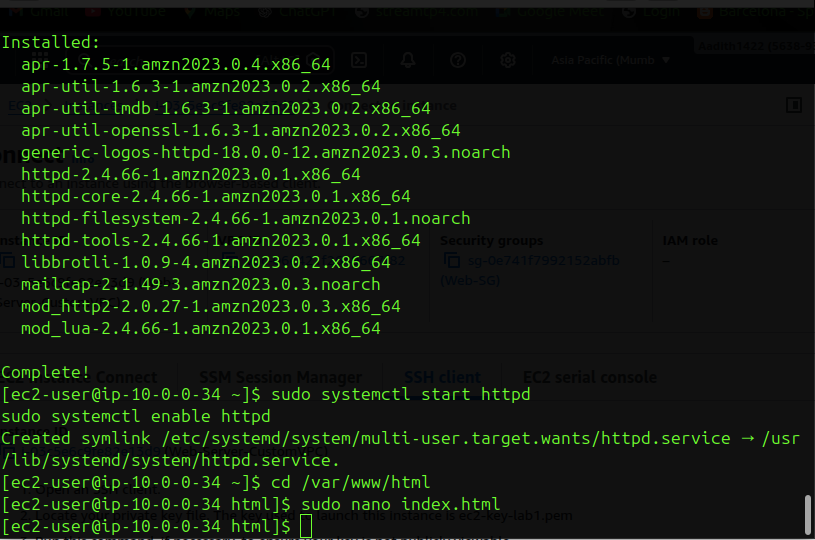
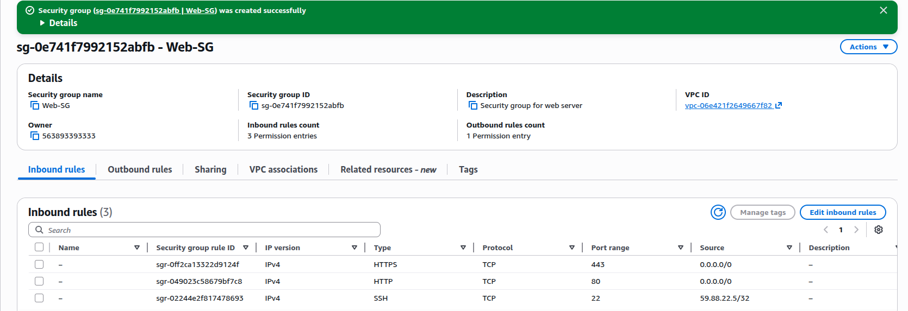
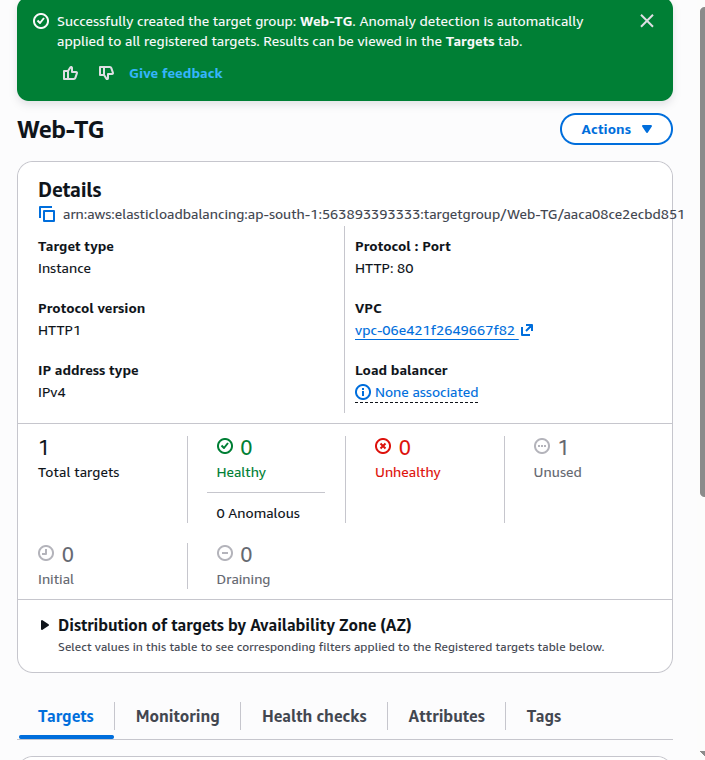
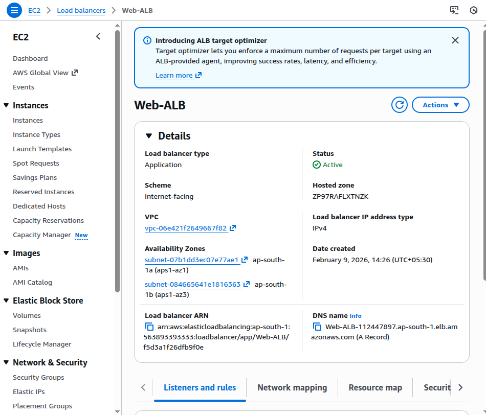
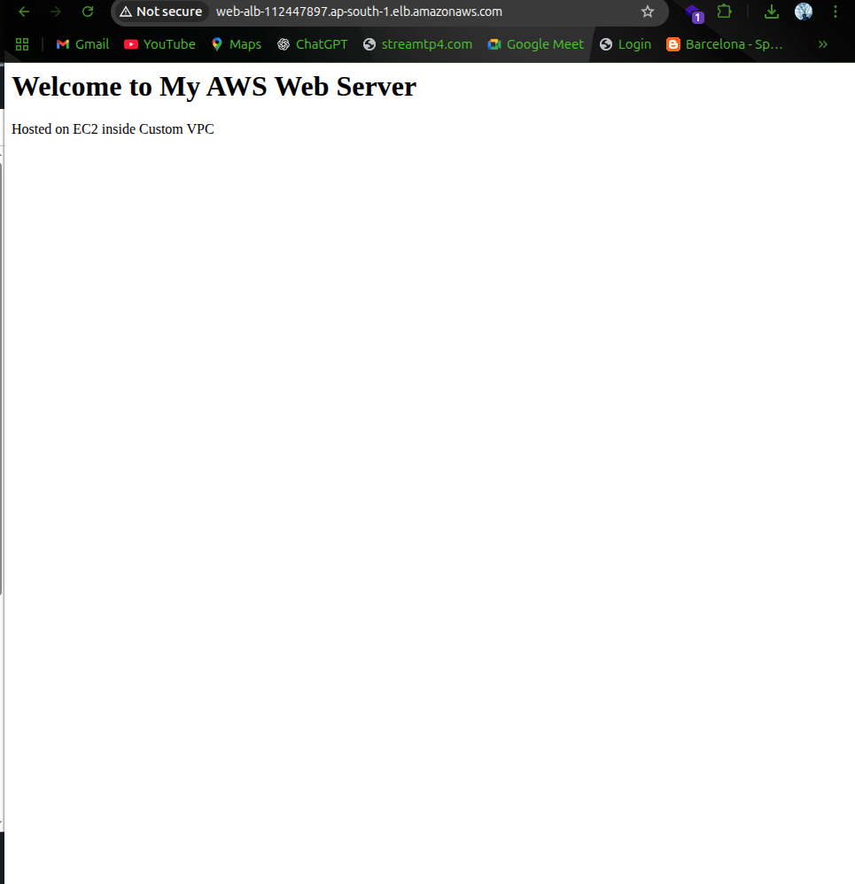

#  AWS EC2, VPC & Application Load Balancer – Hands-On Lab

This repository documents a **complete hands-on implementation of AWS infrastructure** using **EC2, VPC, Security Groups, and an Application Load Balancer**.  
The lab demonstrates how to design, deploy, and test a **highly available web application** in a **custom VPC**.

This README is written as a **professional lab report**, suitable for:
- Academic / college submission
- AWS fundamentals practice
- Cloud & DevOps interviews
- Cybersecurity and SOC learning

---

##  Aim

To design and deploy a secure and scalable web application architecture on AWS by launching an EC2 instance inside a custom VPC and exposing it through an Application Load Balancer.

---

##  Objectives

- Create a custom VPC with public and private subnets  
- Configure Internet Gateway and route tables  
- Launch and connect to an EC2 instance using SSH  
- Host a basic website using Apache Web Server  
- Secure the instance using Security Groups  
- Implement an Application Load Balancer for high availability  
- Verify application access through the load balancer  

---

##  AWS Services Used

- **Amazon EC2** – Virtual compute instance  
- **Amazon VPC** – Custom isolated network  
- **Subnets** – Public and private networking  
- **Internet Gateway** – Internet connectivity  
- **Route Tables** – Traffic routing  
- **Security Groups** – Network firewall  
- **Application Load Balancer (ALB)** – Traffic distribution  
- **Target Group** – Backend instance registration  

---

##  Architecture Overview

```
User
 ↓
Application Load Balancer (Internet-facing)
 ↓
Target Group
 ↓
EC2 Instance (Apache Web Server)
 ↓
Custom VPC (Public Subnets)
```

---

##  Procedure

### Step 1: Create a Custom VPC
- VPC Name: My-Custom-VPC  
- IPv4 CIDR Block: 10.0.0.0/24  

📸 **Screenshot 1:** Custom VPC created  
 *Caption:* Custom VPC created with IPv4 CIDR block 10.0.0.0/24



---

### Step 2: Create Subnets
- Public-Subnet: 10.0.0.0/26  
- Private-Subnet: 10.0.0.64/26  
- Public-Subnet-2: 10.0.0.128/26  


📸 **Screenshot 2:** Subnets list  
 *Caption:* Public and private subnets created inside the custom VPC


---

### Step 3: Create and Attach Internet Gateway
- Internet Gateway created and attached to My-Custom-VPC  

📸 **Screenshot 3:** Internet Gateway  
 *Caption:* Internet Gateway attached to the custom VPC


---

### Step 4: Configure Route Table
- Route added: `0.0.0.0/0 → Internet Gateway`  
- Associated with public subnets  

---

### Step 5: Launch EC2 Instance
- Instance Type: t3.micro  
- OS: Amazon Linux 2023  
- VPC: My-Custom-VPC  
- Subnet: Public Subnet  

📸 **Screenshot 5:** EC2 instance running  
 *Caption:* EC2 instance launched successfully in custom VPC


---

### Step 6: Connect to EC2 Using SSH
- Key permissions updated  
- SSH connection established securely  

📸 **Screenshot 6:** SSH login  
 *Caption:* Secure SSH access to EC2 instance


---

### Step 7: Install Apache Web Server
Commands executed:
```
sudo yum install httpd -y
sudo systemctl start httpd
sudo systemctl enable httpd
```

📸 **Screenshot 7:** Apache installation  
 *Caption:* Apache web server installed and enabled on EC2


---

### Step 8: Host a Website
- File created: `/var/www/html/index.html`  
- Custom HTML content added  


---

### Step 9: Create Security Group
Inbound rules configured:
- SSH (22) – My IP  
- HTTP (80) – Anywhere  
- HTTPS (443) – Anywhere  

📸 **Screenshot 9:** Security Group rules  
 *Caption:* Security group configured for web server access


---

### Step 10: Create Target Group
- Target Type: Instance  
- Protocol: HTTP (80)  
- EC2 instance registered  

📸 **Screenshot 10:** Target Group  
 *Caption:* Target group created and EC2 instance registered


---

### Step 11: Create Application Load Balancer
- Type: Application Load Balancer  
- Scheme: Internet-facing  
- Subnets: Two public subnets  

📸 **Screenshot 11:** Load Balancer active  
 *Caption:* Application Load Balancer created and active


---

### Step 12: Test via Load Balancer DNS
- ALB DNS opened in browser  
- Website loaded successfully  

📸 **Screenshot 12:** Final output  
 *Caption:* Website accessed successfully through Application Load Balancer


---

##  Output

The web application was successfully accessed through the **Application Load Balancer DNS**, confirming proper integration of EC2, VPC, Security Groups, and ALB.

---

##  Result

Thus, a highly available and secure AWS web infrastructure was successfully designed and implemented using EC2, VPC, and Application Load Balancer.

---

##  Conclusion

This lab demonstrates real-world AWS architecture practices including network isolation, security configuration, and load balancing. It provides a strong foundation for cloud computing and DevOps roles.

---

## 📝 Note

This lab was created for **educational purposes**. All AWS resources were terminated after completion to avoid billing.
